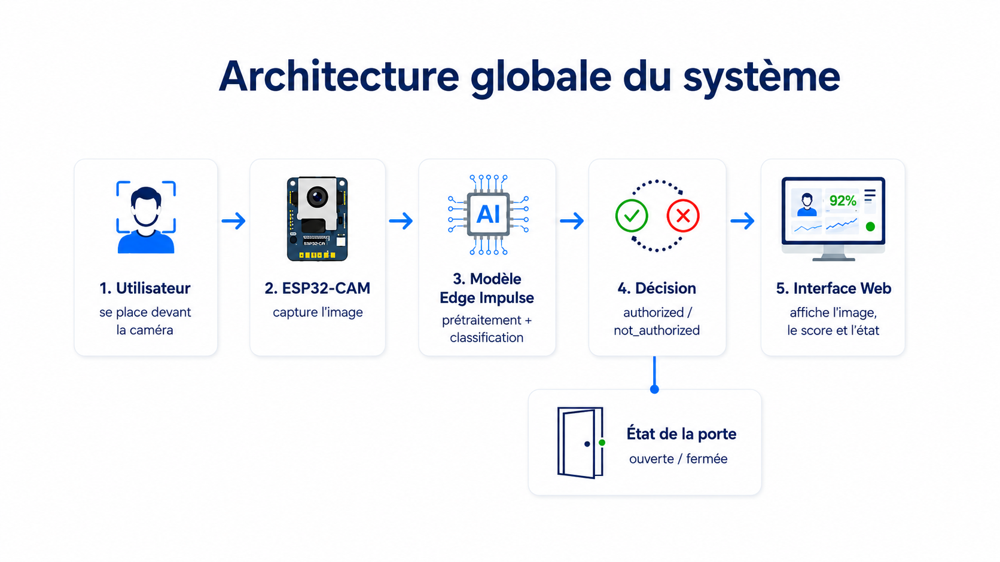
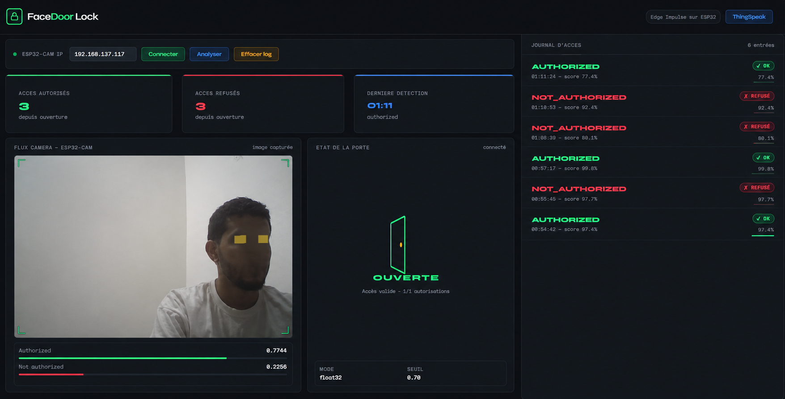
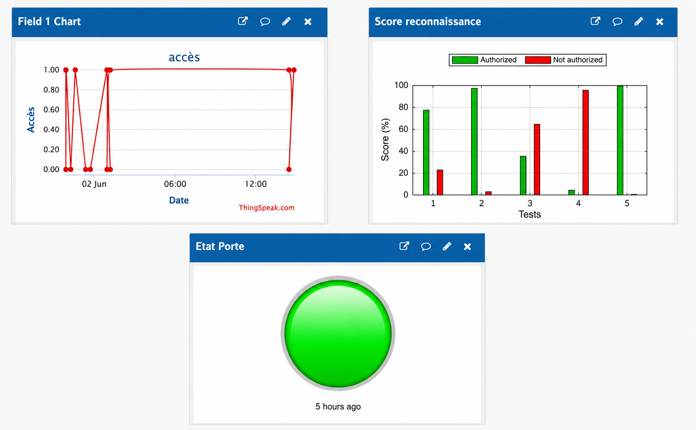

# Face Recognition System with ESP32-CAM and Embedded AI

A smart access control system based on ESP32-CAM and an embedded AI model.

The system captures an image, runs face recognition directly on the ESP32-CAM, displays the result in a web interface, and stores access data in ThingSpeak for IoT monitoring.

---

## Project Overview

This project demonstrates how an ESP32-CAM can be used with an embedded AI model to build a smart access control system.

The model was trained using Edge Impulse and deployed directly on the ESP32-CAM.

The web interface allows the user to:

- connect to the ESP32-CAM
- capture an image
- run face recognition
- display authorized and not authorized scores
- show the door status
- visualize the access log

ThingSpeak is used to store and visualize the results online.

---

## System Architecture



The system follows this process:

1. The user stands in front of the ESP32-CAM.
2. The ESP32-CAM captures an image.
3. The image is processed by the Edge Impulse AI model.
4. The system decides whether the user is authorized or not authorized.
5. The result is displayed in the web dashboard.
6. The access decision and scores are sent to ThingSpeak.

---

## Features

- Face recognition using an embedded AI model
- ESP32-CAM image capture
- Web dashboard for real-time visualization
- Access decision: authorized or not authorized
- Virtual door status: open or closed
- ThingSpeak IoT monitoring
- Access log with confidence scores
- Lightweight system running directly on ESP32-CAM

---

## Hardware Used

- ESP32-CAM AI Thinker
- FTDI USB to Serial adapter
- USB cable
- Jumper wires
- Optional: servo motor or relay for real door control

---

## Software and Tools

- Arduino IDE
- Edge Impulse
- HTML
- CSS
- JavaScript
- ThingSpeak
- GitHub

---

## Project Structure

```text
Face-Recognition-System-with-ESP32-CAM-and-Embedded-AI/
│
├── arduino/
│   └── esp32_camera.ino
│
├── web-interface/
│   ├── index.html
│   ├── script.js
│   └── style.css
│
├── assets/
│   ├── architecture-globale.png
│   ├── interface-web.png
│   └── thingspeak-dashboard.png
│
├── README.md
└── .gitignore
```

---

## Web Interface



The web interface displays:

- captured image from the ESP32-CAM
- authorized score
- not authorized score
- access decision
- virtual door state
- access history log
- number of authorized and refused accesses

---

## ThingSpeak Dashboard



ThingSpeak is used to store and visualize the IoT monitoring data.

It displays:

- access decision
- authorized score
- not authorized score
- door state

---

## How It Works

The ESP32-CAM captures an image in JPEG format.

The image is converted to RGB format because the AI model needs pixel values in Red, Green, and Blue channels.

Then the image is resized according to the input size required by the Edge Impulse model.

The model returns two scores:

- authorized
- not authorized

If the authorized score is greater than the threshold, access is granted.

Otherwise, access is refused.

The decision is sent to the web interface and to ThingSpeak.

---

## Access Decision Logic

```cpp
authorizedScore >= 0.70 && authorizedScore > notAuthorizedScore
```

If this condition is true:

```text
Access = AUTHORIZED
Door = OPEN
```

Otherwise:

```text
Access = NOT_AUTHORIZED
Door = CLOSED
```

---

## ThingSpeak Fields

| Field | Description |
|---|---|
| Field 1 | Access decision |
| Field 2 | Authorized score |
| Field 3 | Not authorized score |
| Field 4 | Door state |
| Field 5 | Authorized hits |
| Field 6 | Refused hits |

---

## Security Note

Before publishing the code, replace sensitive data:

```cpp
const char* ssid = "YOUR_WIFI_NAME";
const char* password = "YOUR_WIFI_PASSWORD";
const char* THINGSPEAK_API_KEY = "YOUR_THINGSPEAK_WRITE_API_KEY";
```

Never publish your real Wi-Fi password or ThingSpeak Write API Key.

---

## Limitations

- The ESP32-CAM has limited memory.
- The camera image quality depends on lighting conditions.
- The current version uses a virtual door state.
- A servo motor or relay can be added for real door control.
- The model accuracy depends on the quality and diversity of the training dataset.

---

## Future Improvements

- Add servo motor control
- Add multiple authorized users
- Improve the dataset with more face angles and lighting conditions
- Add authentication to the web dashboard
- Improve model accuracy with more training data
- Add local storage for access logs

---

## Author

Developed by **MDMAK04**.

Master student in Machine Learning and Artificial Intelligence.
